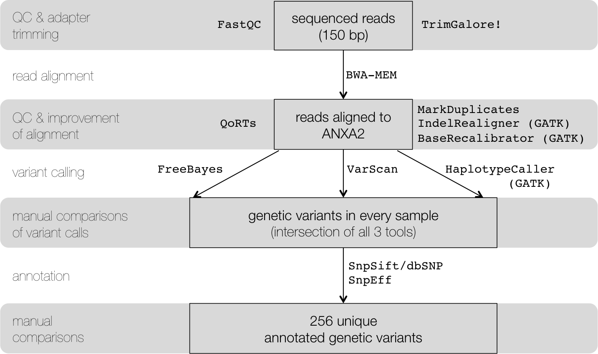

# Methods and VCF files related to Fassel, Chen, Ruise, Kumar, DeSancho and Hajjar (2021). Blood.

The Applied Bioinformatics Core analyzed DNA sequencing data generated after long-range PCR of the AnnexinA2 (ANXA2) gene.
There were samples from three different groups of patients: 1) healthy patients, 2) patients withthrombosis and normal levels of ANXA2, and 3) patients with thrombosis and low or undetectable levels of ANXA2. Following the Broad Institute’s/GATK best practices, variants were identified, annotated, and manually explored.

DNA  samples  were  collected  from  18  patients:

* 6  healthy  patients
* 6  patients  with  thrombosis  and  normal  levels of  ANXA2,  and  
* 6  patients  with  thrombosis  and  low  or  undetectable  levels  of  ANXA2.

The  ANXA2  gene  is  approximately  60  kb  long,  and  was  isolated  via  long  range  PCR  (with  10  kb  5’  and  1  kb  3’  flanking  regions).
The resultant isolates were fragmented and subsequently sequenced (single-end, 150 bp) on an Illumina MiSeq Sequencerat Cornell's Genomics Facility in Ithaca, NY.

The goal of the analysis was to determine whether there are genetic variants that are unique to the patients with thrombosis and low ANXA2 levels.

For variant calling, the following tools were used: FreeBayesv1.0.2-33, VarScan v2.3.9, and HaplotypeCaller v3.6-0.
Variants that were identified by all three tools were used for downstream analyses including annotation with SnpEff.

The following figure demonstrates the bioinformatics workflow and tools.

The `makefile` in [`processing/`](processing) contains the details of the code.

## Results

The individual VCF files can be found in [`variants/`](variants)

 

Illustration of the ANXA2 region that was amplified using long-range PCR and sequenced with high-throughput DNA sequencing.
From top to bottom: Ideogram of chromosome 15 where the red vertical bar indicates the position of the ANXA2 locus.
The numbers of overlapping reads (from one randomly chosen sample) for each base pair are summarized as grey vertical bars, followed by a blue heatmap track that represents GC content.
High GC content (dark blue regions) tend to co-occur with regions of particularly low read coverage, which is a known bias of Illumina-based high-throughput sequencing data [Meyer2014](https://dx.doi.org/doi:10.1038/nrg3788).
Transcript models are based on Gencode V23 (hg38); dark blue boxes represent exons, horizontal lines represent introns.
At the bottom of the figure, some abundant repeat classes are shown (there are no known tRNAs and rRNAs at this locus).

The heatmap of genotypes visualizes single variants (columns) and their status (WT/WT, WT/ALT, ALT/ALT) for the individual samples (rows).
Light cyan indicates homozygosity for the reference allele, medium cyan heterozygosity, and dark cyan homozygosity for the alternative allele.
The boxes on the left side mark healthy (green), TL (red) and TN (blue) as well as male (brown) and female (off-white) samples.

There was no obvious sample type specific pattern, i.e., no overrepresentation of homo- or heterozygous variants in either sample group.

---------

The analyses were performed at the Applied Bioinformatics Core of Weill Cornell Medicine by Paul Zumbo, Luce Skrabanek & Friederike Dündar.
Don't hesitate to [get in touch](https://abc.med.cornell.edu/) with questions related to the code and the analysis.
